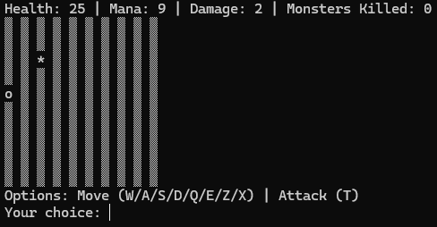
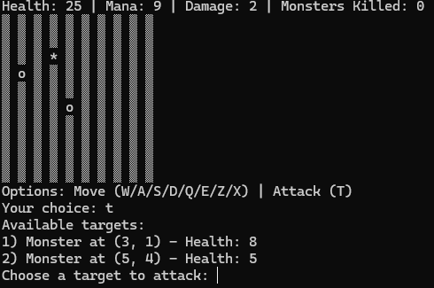

# RPG Console Game

A console-based RPG game written in C# using Entity Framework. The game allows players to create characters, fight monsters, and track progress using a database. 

---

## How It Looks

### Start of the Game
When you begin the game, you can see the grid and hero starting position.



### Attacking a Monster
Here's an example of attacking a monster:



---

### Setup Instructions

1. **Clone the Repository**
   - Clone the repository to your local machine:
     ```bash
     git clone https://github.com/yavot1516/RPG-Console-Game.git
     ```

2. **Configure the Database**
   - Open the `RPGContext.cs` file in the `Models` folder.
   - Locate the `OnConfiguring` method:
     ```csharp
     protected override void OnConfiguring(DbContextOptionsBuilder optionsBuilder)
     {
         optionsBuilder.UseSqlServer("Server=EXAMPLE;Database=RPG_Db;Trusted_Connection=True;");
         // Replace EXAMPLE with your SQL Server name.
     }
     ```
   - Replace `EXAMPLE` with your **SQL Server name**.

3. **Apply Migrations**
   - Open the **Package Manager Console** in Visual Studio.
   - Run the following commands to apply migrations and update the database:
     ```powershell
     Add-Migration Initial
     Update-Database
     ```

4. **Run the Game**
   - Press `F5` or run the project in Visual Studio to start the game.

---

## How to Play
1. **Main Menu**: Press any key to start the game.
2. **Character Selection**:
   - Choose a character type: Warrior, Mage, or Archer.
   - Optionally, customize your character's stats.
3. **In-Game**:
   - Navigate the 10x10 grid.
   - **Move**: Use `W/A/S/D` for cardinal directions, `Q/E/Z/X` for diagonal directions.
   - **Attack**: Press `T` to attack monsters within range.
4. **Game Over**: The game ends when your hero's health drops to zero.

---

## Game Requirements
- A 10x10 grid field.
- Character races:
  - **Warrior**: Strength = 3, Agility = 3, Intelligence = 0, Range = 1, Symbol = `@`.
  - **Archer**: Strength = 2, Agility = 4, Intelligence = 0, Range = 2, Symbol = `#`.
  - **Mage**: Strength = 2, Agility = 1, Intelligence = 3, Range = 3, Symbol = `*`.
- Monsters:
  - Random Strength, Agility, Intelligence (1-3).
  - Range = 1, Symbol = `o`.
- Logging:
  - Tracks heroes, games, and monsters in the database.
